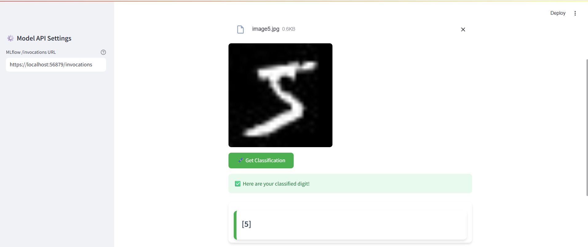

# ✍️ Handwritten digit classification with keras

## 📚 Contents

- [🧠 Overview](#overview)
- [🗂 Project Structure](#project-structure)
- [⚙️ Setup](#setup)
- [🚀 Usage](#usage)
- [📞 Contact and Support](#contact-and-support)

---

# Overview

This project shows how to do a image classification, specifically digits of handwritten images, using TensorFlow and MNIST(Modified National Institute of Standards and Technology) dataset of handwritten digits. The MNIST dataset consists of a collection of handwritten digits from 0 to 9. 

---

# Project Structure

```
├── demo
│   └── streamlit-webapp/                                             # Streamlit UI
├── docs/
│   └── streamlit_ui_handwritten_digit_classification.pdf             # UI screenshot
│   └── streamlit_ui_handwritten_digit_classification.png             # UI screenshot
├── notebooks
│   └── handwritten_digit_classification_with_keras.ipynb             # Main notebook for the project  
├── README.md                                                         # Project documentation
```

---

# Setup

### 0 ▪ Minimum Hardware Requirements

Ensure your environment meets the minimum compute requirements for smooth image classification performance:

- **RAM**: 16 GB  
- **VRAM**: 4 GB  
- **GPU**: NVIDIA GPU

### 1 ▪ Create an AI Studio Project

- Create a new project in [Z by HP AI Studio](https://zdocs.datascience.hp.com/docs/aistudio/overview).

### 2 ▪ Set Up a Workspace

- Choose **Deep Learning** as the base image.

### 3 ▪ Clone the Repository

1. Clone the GitHub repository:  
   ```
   git clone https://github.com/HPInc/AI-Blueprints.git
   ```

2. Ensure all files are available after workspace creation.

---

# Usage

### 1 ▪ Run the Notebook

Execute the notebook inside the `notebooks` folder:

```bash
notebooks/handwritten_digit_classification_with_keras.ipynb
```

This will:

- Load and preprocess the MNIST data 
- Create the model architecture  
- Train the model
- Make inference
- Integrate MLflow 

### 2 ▪ Deploy the Handwritten Digit Classification Service

- Go to **Deployments > New Service** in AI Studio.
- Name the service and select the registered model.
- Choose a model version and **GPU** it's **not necessary**.
- Choose the workspace.
- Start the deployment.
- Note: This is a local deployment running on your machine. As a result, if API processing takes more than a few minutes, it may return a timeout error. If you need to work with inputs that require longer processing times, we recommend using the provided notebook in the project files instead of accessing the API via Swagger or the web app UI.

### 3 ▪ Swagger / raw API

Once deployed, access the **Swagger UI** via the Service URL.


Paste a payload like:

```
{
  "inputs": {
    "digit": [
      ""/9j/4AAQSkZJRgABAQAAAQABAAD/2wBDAAgGBgcGBQgHBwcJCQgKDBQNDAsLDBkSEw8UHRofHh0aHBwgJC4nICIsIxwcKDcpLDAxNDQ0Hyc5PTgyPC4zNDL/wAALCAAcABwBAREA/8QAHwAAAQUBAQEBAQEAAAAAAAAAAAECAwQFBgcICQoL/8QAtRAAAgEDAwIEAwUFBAQAAAF9AQIDAAQRBRIhMUEGE1FhByJxFDKBkaEII0KxwRVS0fAkM2JyggkKFhcYGRolJicoKSo0NTY3ODk6Q0RFRkdISUpTVFVWV1hZWmNkZWZnaGlqc3R1dnd4eXqDhIWGh4iJipKTlJWWl5iZmqKjpKWmp6ipqrKztLW2t7i5usLDxMXGx8jJytLT1NXW19jZ2uHi4+Tl5ufo6erx8vP09fb3+Pn6/9oACAEBAAA/APAACzBVBJJwAO9dnp/wm8damu6Dw5dRjGf9IKw/+hkVPffCnWNJa7XVNV0Kxa1hErrNe/M2cnYqgElsAHpjkc1wlAODkV694W8c654t8M6n4TuvEctrrFw0cun3c0/lq+3AMJcDK5AyOeTkd+fPvGFn4gsvEtzF4m89tUG1ZJJjuMgUBVYN/EMKOe9YVXtK0bUtdvVs9LsZ7y4YgbIULYycZPoPc8V6lpfwh0/w7p66z8RdXj0y2z8llC4aWQ+mRn8lz9RXPfE3x1pvi46TYaPZTQadpMJghluWDSyrhQM9SMBe5Oc5NcBV7Tda1XRZJJNK1O8sXkG12tZ2iLD0JUjNQ3l9eahN517dT3MvTfNIXb16n6mq9Ff/2Q==""
    ]
  },
  "params": {}
}
```

### 4 ▪ Launch the Streamlit UI

1. To launch the Streamlit UI, follow the instructions in the README file located in the `demo/streamlit-webapp` folder.

2. Navigate to the shown URL and view the handwritten classification.

### Successful UI demo

- Streamlit


---

# Contact and Support  

- Issues: Open a new issue in our [**AI-Blueprints GitHub repo**](https://github.com/HPInc/AI-Blueprints).

- Docs: Refer to the **[AI Studio Documentation](https://zdocs.datascience.hp.com/docs/aistudio/overview)** for detailed guidance and troubleshooting. 

- Community: Join the [**HP AI Creator Community**](https://community.datascience.hp.com/) for questions and help.

---

> Built with ❤️ using [**Z by HP AI Studio**](https://www.hp.com/us-en/workstations/ai-studio.html).
