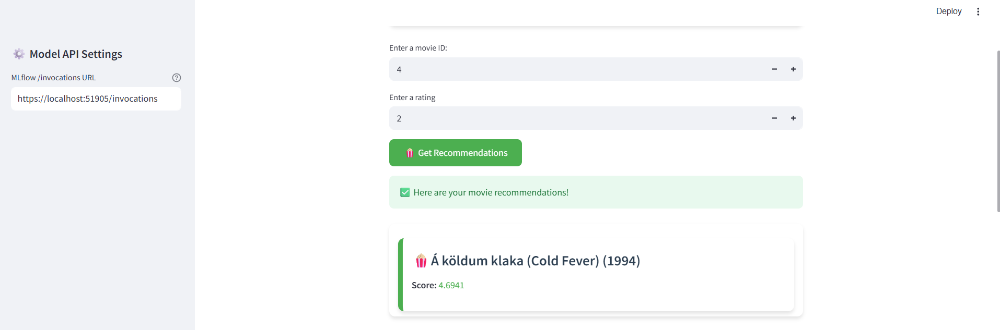

# 🎥 Recommender Systems with Tensorflow

## 📚 Contents

- [🧠 Overview](#overview)
- [🗂 Project Structure](#project-structure)
- [⚙️ Setup](#setup)
- [🚀 Usage](#usage)
- [📞 Contact and Support](#contact-and-support)

---

## 🧠 Overview

This project builds a simple **recommender system** for movies using **TensorFlow**.  
It trains on user-item interaction data to predict movie preferences with Model-based Collaborative Filtering.

---

## 🗂 Project Structure

```
├── docs/      
│   └── streamlit_ui_for_recommender_system.pdf               # UI screenshot
│   └── streamlit_ui_for_recommender_system.png               # UI screenshot
├── demo
│   └── streamlit-webapp/                                     # Streamlit UI
├── notebooks
│   └── recommender_systems_with_tensorflow.ipynb             # Main notebook for the project              
├── README.md                                                 # Project documentation
```

---

## ⚙️ Setup

### Step 0 ▪ Minimum Hardware Requirements

Ensure your environment meets the minimum compute requirements for smooth image classification performance:

- **RAM**: 16 GB  
- **VRAM**: 4 GB  
- **GPU**: NVIDIA GPU

### Step 1 ▪ Create an AI Studio Project

- Create a new project in [Z by HP AI Studio](https://zdocs.datascience.hp.com/docs/aistudio/overview).

### Step 2 ▪ Set Up a Workspace

- Choose **Deep Learning** as the base image.

### Step 3 ▪ Download the Dataset
1. This experiment requires the **tutorial_data dataset** to run.
2. Download the dataset from `s3://dsp-demo-bucket/tutorial_data/` into an asset called **tutorial** and ensure that the AWS region is set to ```us-west-2```.

### Step 4: Clone the Repository

1. Clone the GitHub repository:  
   ```
   git clone https://github.com/HPInc/AI-Blueprints.git
   ```

2. Ensure all files are available after workspace creation.

---

## 🚀 Usage

### 1 ▪ Run the Notebook

Execute the notebook inside the `notebooks` folder:

```bash
notebooks/recommender_systems_with_tensorflow.ipynb
```

This will:

- Load and prepare the data
- Create the model architecture  
- Train the model
- Make inference
- Integrate MLflow  

### 2 ▪ Deploy the Movie Recommendation Agent Service

- Go to **Deployments > New Service** in AI Studio.
- Name the service and select the registered model.
- Choose a model version and **GPU** it's **not necessary**.
- Choose the workspace.
- Start the deployment.
- Note: This is a local deployment running on your machine. As a result, if API processing takes more than a few minutes, it may return a timeout error. If you need to work with inputs that require longer processing times, we recommend using the provided notebook in the project files instead of accessing the API via Swagger or the web app UI.

### 3 ▪ Swagger / raw API

Once deployed, access the **Swagger UI** via the Service URL.


Paste a payload like:

```
{
  "inputs": {
    "movie_id": [
      5
    ],
    "rating": [
      3.5
    ]
  },
  "params": {}
}
```

### 4 ▪ Launch the Streamlit UI

1. To launch the Streamlit UI, follow the instructions in the README file located in the `demo/streamlit-webapp` folder.

2. Navigate to the shown URL and view the handwritten classification.

### Successful UI demo

- Streamlit



---

## 📞 Contact & Support

- Issues & Bugs: Open a new issue in our [**AI-Blueprints GitHub repo**](https://github.com/HPInc/AI-Blueprints).

- Docs: [**AI Studio Documentation**](https://zdocs.datascience.hp.com/docs/aistudio/overview).

- Community: Join the [**HP AI Creator Community**](https://community.datascience.hp.com/) for questions and help.


---

> Built with ❤️ using [**Z by HP AI Studio**](https://www.hp.com/us-en/workstations/ai-studio.html).