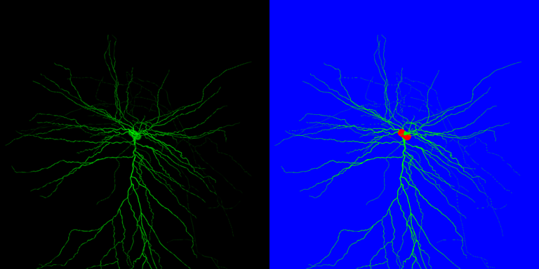

Neuron Segmentation
===================

This project is for training a U-net model to segment the soma and neurites of a neuron.

<p align="center">
    
</p>

This project is unique in that the imagery is from a simulated fluorescent confocal microscope and the neuron geometry
is from a collection of digitally reconstructed neurons. This allows the model to be trained with physically based
parameters, such as the Z step distance.  The sister project for simulating microscopes can be found
[here](https://github.com/tay10r/neuroscope). We plan on expanding the capabilities of the simulation to include phase
contrast microscopy and more physically-based parameterization of confocal fluorescent microscopes. We source the neuron
 models from [NeuroMorpho](neuromorpho.org) and support reading standardized SWC files.

### Project Structure

```
| - notebooks
|   | - synthetic_data_generation.ipynb    # Use this notebook first, to generate the training data.
|   | - model_training.ipynb               # This trains a variant of U-net to segment the neurons.
| - docs
|   | - README.md                          # This file.
```

### Setup

We use HP AI Studio to generate data and train models. This allows us to iterate quickly between tweaking physical
parameters of the microscope and training the model. If you're familiar with how to setup and run Jupyter, MLFlow, and
Tensorboard, you may also set those up and run the code with your own configuration. To get started with HP AI Studio:

| Step | Instructions                         |
|------|--------------------------------------|
|    1 | Create a new project in HP AI Studio |