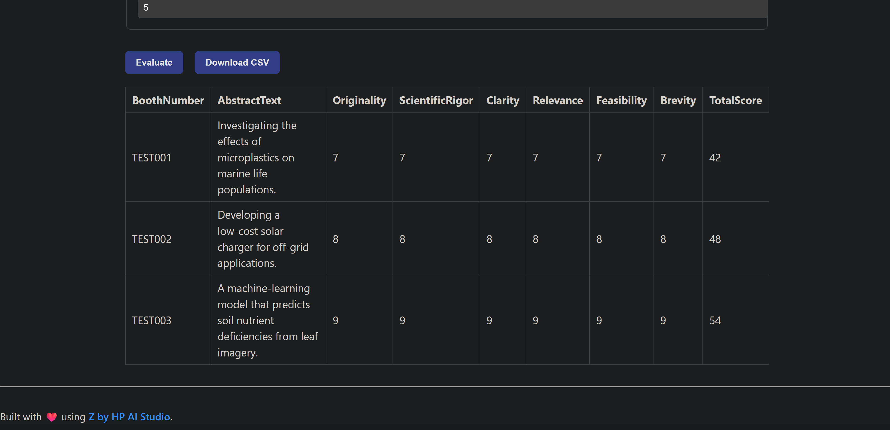
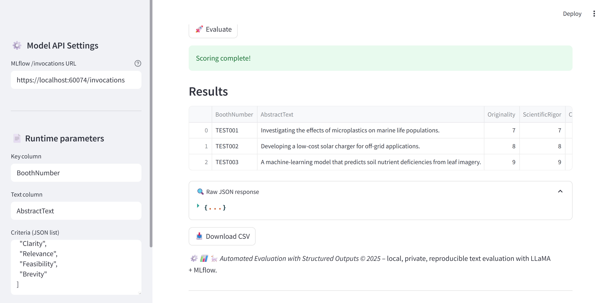

# 📊 Automated Evaluation with Structured Outputs

# 📚 Contents

* [🧠 Overview](#overview)
* [🗂 Project Structure](#project-structure)
* [⚙️ Setup](#setup)
* [🚀 Usage](#usage)
* [📞 Contact and Support](#contact-and-support)

---

# Overview

**Automated Evaluation with Structured Outputs** turns a local **Meta‑Llama‑2** model into an MLflow‑served scorer that rates any batch of texts (e.g., project abstracts) against arbitrary rubric criteria.
The pipeline:

* Generates scores locally via `llama.cpp` (no data leaves your machine)
* Registers the evaluator as a **pyfunc** model in MLflow
* Exposes a REST `/invocations` endpoint
* Ships two front‑ends — a **Streamlit** dashboard and a pure **HTML/JS** UI — for instant human‑friendly interaction and CSV download.

---

# Project Structure

```
├── demo
│   ├── index.html                 # Lightweight HTML/JS UI
│   └── streamlit-webapp/          # Streamlit UI
├── docs/
│   └── html_ui_for_automated_evaluation.png          # UI screenshot
│   └── streamlit_ui_for_automated_evaluation.png          # UI screenshot
│   └── successful html ui result for automated evaluation.pdf          # UI pdf
│   └── successful streamlit ui result for automated evaluation.pdf          # UI pdf
├── notebooks
│   └── automated_evaluation_with_structured_outputs.ipynb   # One‑click notebook to to setup the pipeline and create the api
│   └── isef_evaluation_with_llama.ipynb   # One‑click notebook to evaluate isef projects with local Llama model
│   └── isef_evaluation_with_openai.ipynb   # One‑click notebook to evaluate isef projects with openAI model
├── README.md
└── requirements.txt
```

---

# Setup

### 0 ▪ Minimum hardware

* **RAM:** 64 GB
* **VRAM:** 12 GB
* **GPU:** NVIDIA (CUDA)

### 1 ▪ Create an AI Studio project

Log into [Z by HP AI Studio](https://zdocs.datascience.hp.com/docs/aistudio/overview) and start a **Local GenAI** workspace.

### 2 ▪ Clone the repo

```bash
git clone https://github.com/HPInc/aistudio-samples.git
```

### 3 ▪ Add the Llama‑3 model

- Download the 7-B‑Instruct GGUF via Models tab:

  * **Model Name**: `llama2-7b`
  * **Model Source**: `AWS S3`
  * **S3 URI**: `s3://149536453923-hpaistudio-public-assets/llama2-7b`
  * **Bucket Region**: `us-west-2`

- Make sure that the model is in the `datafabric` folder inside your workspace. If the model does not appear after downloading, please restart your workspace.

### 4 ▪ Configure secrets (optional)

Edit `configs/secrets.yaml` if you plan to call external APIs; not required for pure local inference.

### 5 ▪ Input File

You need to setup your input files in the 5th cell to work with your input csv files and configuration.

---

# Usage

### 1 ▪ Run the notebook

Open **`notebooks/automated_evaluation_with_structured_outputs.ipynb`**, run all cells.
This will:

1. Load the GGUF model
2. Setup the pipeline
3. Log **`LlamaEvaluatorModel`** to MLflow

### 2 ▪ Deploy the LlamaEvaluator Service

- Go to **Deployments > New Service** in AI Studio.
- Name the service and select the registered model.
- Choose a model version and enable **GPU acceleration**.
- Start the deployment.
- Note: This is a local deployment running on your machine. As a result, if API processing takes more than a few minutes, it may return a timeout error. If you need to work with inputs that require longer processing times, we recommend using the provided notebook in the project files instead of accessing the API via Swagger or the web app UI.

### 3 ▪ Swagger / raw API

Once deployed, access the **Swagger UI** via the Service URL.


Paste a payload like:

```jsonc
{
  "dataframe_split": {
    "columns": ["BoothNumber", "AbstractText"],
    "data": [
      ["TEST001","Microplastics impact on marine life"],
      ["TEST002","Low‑cost solar charger for off‑grid use"]
    ]
  },
  "params": {
    "key_column":"BoothNumber",
    "eval_column":"AbstractText",
    "criteria":"[\"Originality\",\"ScientificRigor\",\"Clarity\",\"Relevance\",\"Feasibility\",\"Brevity\"]",
    "batch_size":2
  }
}
```

### 4 ▪ Use the HTML UI

 From the Swagger page, click the demo link to interact with the locally deployed vanilla RAG chatbot via UI.

### 5 ▪ Launch the Streamlit UI

1. To launch the Streamlit UI, follow the instructions in the README file located in the `demo/streamlit-webapp` folder.

2. Navigate to the shown URL, upload a CSV, tweak parameters, and view scores.


### Successful UI demo

- HTML
  

- Streamlit
  


---

# Contact and Support

* 💬 Open an [issue](https://github.com/HPInc/aistudio-samples/issues) for bugs or questions.
* 📘 See [AI Studio Docs](https://zdocs.datascience.hp.com/docs/aistudio/overview) for help.

---

> Built with ❤️ using [**Z by HP AI Studio**](https://zdocs.datascience.hp.com/docs/aistudio/overview).
