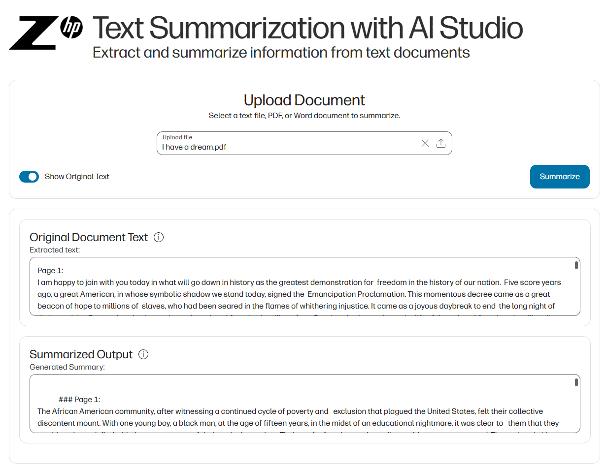

# Text Summarization with LangChain and Galileo

## 📚 Contents

- Overview
- Project Structure
- Setup
- Usage
- Contact & Support

---

## 🧠 Overview

This project demonstrates how to build a semantic chunking and summarization pipeline for transcripts using **LangChain**, **Sentence Transformers**, and **Galileo** for model evaluation, protection, and observability. It leverages the **Z by HP AI Studio Local GenAI image** and the **LLaMA2-7B** model to generate concise and contextually accurate summaries from transcript data.

---

## 🗂 Project Structure

```
├── README.md
├── core
│   └── service
│       ├── __init__.py
│       └── text_summarization_service.py
├── data
│   ├── I_have_a_dream.txt
│   └── I_have_a_dream.vtt
├── notebooks
│   └── transcript-summarization-with-langchain-and-galileo.ipynb
└── requirements.txt
```

---

## ⚙️ Setup

### Step 1: Create an AI Studio Project

- Create a new project in [Z by HP AI Studio](https://zdocs.datascience.hp.com/docs/aistudio/overview).
- (Optional) Add a description and relevant tags.

### Step 2: Set Up a Workspace

- Choose **Local GenAI** as the base image.

### Step 3: Clone the Repository

```bash
https://github.com/HPInc/aistudio-galileo-templates.git
```

- Ensure all files are available after workspace creation.

### Step 4: Add the Model to Workspace

- Download the **LLaMA2-7B** model from AWS S3 using the Models tab in your AI Studio project:
  - **Dataset Name**: `llama2-7b`
  - **Dataset Source**: `AWS S3`
  - **S3 URI**: `s3://149536453923-hpaistudio-public-assets/llama2-7b`
  - **Bucket Region**: `us-west-2`
- Make sure that the model is in the `datafabric` folder inside your workspace.
  
### Step 5: Configure Secrets and Paths

- Add your API keys to the `secrets.yaml` file under the `configs` folder:
  - `HUGGINGFACE_API_KEY`
  - `GALILEO_API_KEY`
- Edit `config.yaml` with relevant configuration details.

---

## 🚀 Usage

### Step 1: Run the Notebook

Execute the notebook inside the `notebooks` folder:

```bash
notebooks/transcript-summarization-with-langchain-and-galileo.ipynb
```

This will:
- Set up the semantic chunking pipeline
- Create the summarization chain with LangChain
- Integrate Galileo evaluation, protection, and observability
- Register the model in MLflow

### Step 2: Deploy the Summarization Service

- Go to **Deployments > New Service** in AI Studio.
- Name the service and select the registered model.
- Choose a model version and enable **GPU acceleration**.
- Start the deployment.
- Once deployed, access the **Swagger UI** via the Service URL.
- Use the API endpoints to generate summaries from your transcript data.

### Successful Demonstration of the User Interface  



---

## 📞 Contact & Support

- 💬 For issues or questions, please [open a GitHub issue](https://github.com/HPInc/aistudio-galileo-templates/issues).
- 📘 Refer to the official [AI Studio Documentation](https://zdocs.datascience.hp.com/docs/aistudio/overview) for detailed instructions and troubleshooting tips.

---

> Built with ❤️ using Z by HP AI Studio.
