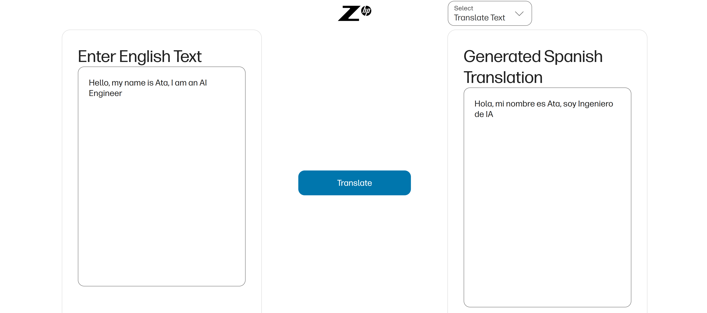
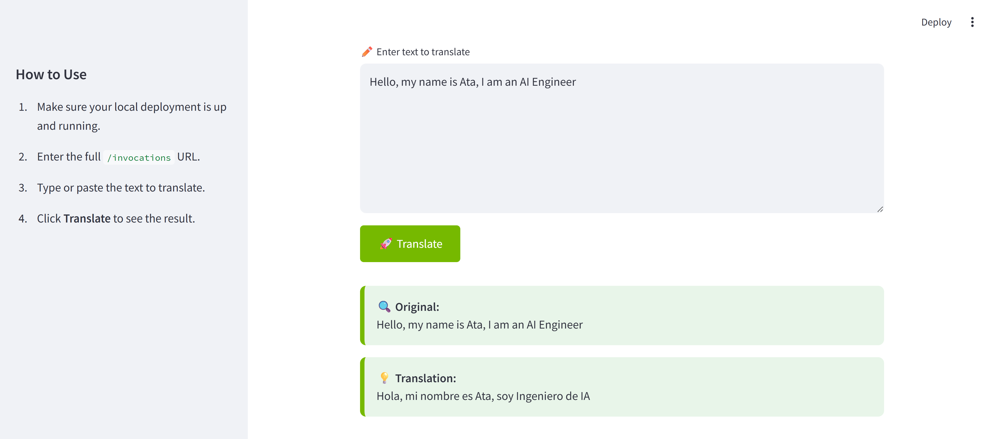

# 🎙️ Audio Translation with NeMo Models

# 📚 Contents

* [🧠 Overview](#overview)
* [🗂 Project Structure](#project-structure)
* [⚙️ Setup](#setup)
* [🚀 Usage](#usage)
* [📞 Contact and Support](#contact-and-support)

---

# 🧠 Overview

This project demonstrates an end-to-end **audio translation pipeline** using **NVIDIA NeMo models**. It takes an English audio sample and performs:

1. **Speech-to-Text (STT)** conversion using Citrinet  
2. **Text Translation (TT)** from English to Spanish using NMT  
3. **Text-to-Speech (TTS)** synthesis in Spanish using FastPitch and HiFiGAN  

All steps are GPU-accelerated, and the full workflow is integrated with **MLflow** for experiment tracking and model registration.

---

# 🗂 Project Structure

```
├── data
│   ├── ForrestGump.mp3
│   └── June18.mp3
├── demo
│   └── ...
├── docs
│   ├── react_ui_for_audio_translation.png
│   ├── streamlit_ui_for_audio_translation.png
│   ├── successful react ui result for audio translation.pdf
│   └── successful streamlit ui result for audio translation.pdf
├── notebooks
│   └── english_to_spanish.ipynb
├── README.md
└── requirements.txt
```

---

# ⚙️ Setup

### 0 ▪ Minimum Hardware Requirements

Ensure your environment meets the minimum hardware requirements for smooth model inference:

- RAM: 16 GB  
- VRAM: 8 GB  
- GPU: NVIDIA GPU

### 1 ▪ Create an AI Studio Project

- Create a new project in [Z by HP AI Studio](https://zdocs.datascience.hp.com/docs/aistudio/overview).

### 2 ▪ Set Up a Workspace

- Choose the **NeMo Framework** image from the **NVIDIA NGC Catalog** in AI Studio during workspace setup.

### 3 ▪ Clone the Repository

```bash
https://github.com/HPInc/aistudio-samples.git
```

- Ensure all files are available after workspace creation.

### 4 ▪ Add Required NeMo Models

From the **Models** tab, add the following models from the model catalog in AI Studio:

1. **Speech-to-Text (STT)**  
   - Model: `stt_en_citrinet_1024_gamma_0_25-1.0.0`  
   - Asset Name: `STT En Citrinet 1024 Gamma 0.25`

2. **Neural Machine Translation (NMT)**  
   - Model: `nmt_en_es_transformer12x2-1.0.0rc1`  
   - Asset Name: `NMT En Es Transformer12x2`

3. **Text-to-Speech (TTS)**  
   - Model: `tts_es_multispeaker_fastpitchhifigan-1.15.0`  
   - Asset Name: `TTS Es Multispeaker FastPitch HiFiGAN`

Make sure these models are downloaded and available in the `datafabric` folder inside your workspace.

---

# 🚀 Usage

### 1 ▪ Run the Notebook

Open and run the notebook located at:

```bash
notebooks/english_to_spanish.ipynb
```

This will:

- Load STT, NMT, and TTS models from the NGC assets  
- Convert an English audio file to English text  
- Translate the text into Spanish  
- Synthesize spoken Spanish audio from the translated text  
- Log the entire workflow as a composite model in **MLflow**

### 2 ▪ Deploy the Nemo Translation Service

- In AI Studio, navigate to **Deployments > New Service**.  
- Give your service a name (e.g. “NemoTranslation”), then select the registered NemoTranslationModel.  
- Pick the desired model version and enable **GPU acceleration** for best performance.  
- Click **Deploy** to launch the service.

### 3 ▪ Swagger / Raw API

Once your service is running, open the **Swagger UI** from its Service URL.  

#### Example payload for text-only translation:
```jsonc
{
  "dataframe_records": [
    {
      "source_text": "Hello, world!",
      "source_serialized_audio": ""
    }
  ],
  "parameters": {
    "use_audio": false
  }
}
````

Paste that into the Swagger “/invocations” endpoint and click **Try it out** to see the raw JSON response.

### 4 ▪ Use the HTML Demo

From the Swagger page, click the **“Demo”** link to interact via a simple web form:

* Enter your source text.
* Click **Translate**.
* View the translated text right in the browser.

### 5 ▪ Launch the Streamlit UI

1. To launch the Streamlit UI, follow the instructions in the README file located in the `demo/streamlit-webapp` folder.
2. Enter text to translate, hit **Translate**, and enjoy the live results!


### Successful UI demo

- React
  

- Streamlit
  

---

# 📞 Contact & Support

* 💬 Open an [issue](https://github.com/HPInc/aistudio-samples/issues) for bugs or questions.
* 📘 See [AI Studio Docs](https://zdocs.datascience.hp.com/docs/aistudio/overview) for help.

---

> Built with ❤️ using [**Z by HP AI Studio**](https://zdocs.datascience.hp.com/docs/aistudio/overview).
